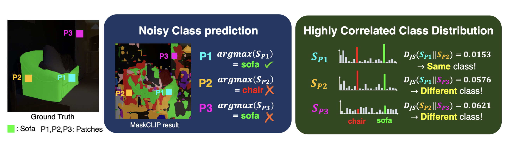
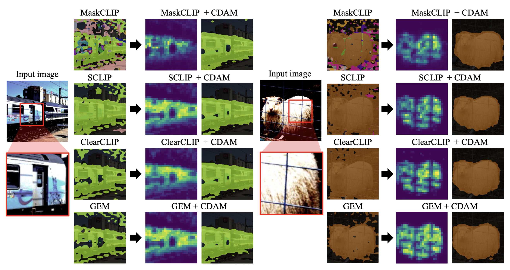
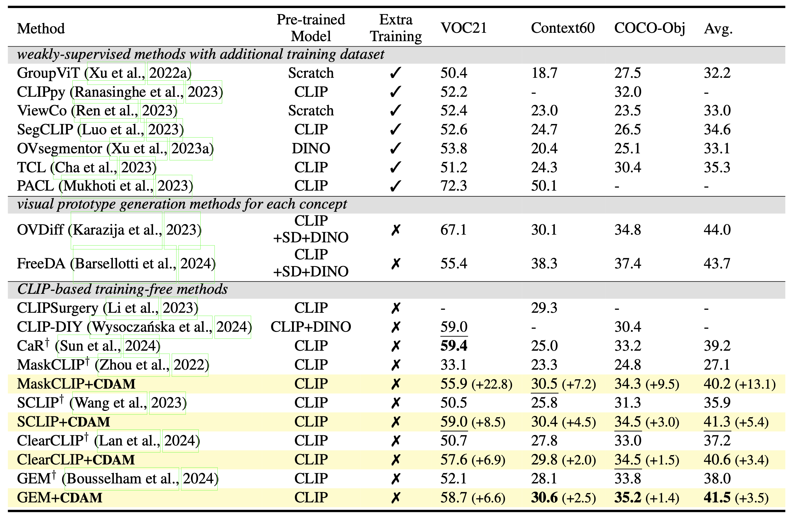

# [ICLR25] CDAM: Class Distribution-induced Attention Map for Open-vocabulary Semantic Segmentations

**Official PyTorch implementation of CDAM**


* [CDAM: Class Distribution-induced Attention Map for Open-vocabulary Semantic Segmentations](https://openreview.net/pdf?id=CMqOfvD3tO).
* Proposing class distribution-induced attention map (CDAM) that yields higher weights to class-relevant patches to enhance localization capability by exploiting **robust class distribution** over **noisy class prediction** for the patches of each object class. 
*  Proposing CDAM with multi-scale image patches, augmented text prompts, and entropy-based background thresholding for further improving the CDAM.
* Demonstrating that our CDAM remarkably outperformed prior arts on CLIP-based training-free zero-shot semantic segmentation over diverse benchmark datasets.


**Observation for similarity of class distributions between patches:**



**Qualitative segmentation results of CDAM from inaccurate initial predictions:**




## Dependencies

This repo is built on top of [CLIP](https://github.com/openai/CLIP), [MMSegmentation](https://github.com/open-mmlab/mmsegmentation) and [SCLIP](https://github.com/wangf3014/SCLIP/blob/main/README.md). To run CDAM, please install the following packages with your Pytorch environment. We recommend using Pytorch==1.9.x for better compatibility to the following MMSeg version.

```
conda create -n cdamclip python=3.9
conda activate cdamclip
pip install torch==1.13.1 torchvision==0.14.1 torchaudio==0.13.1
pip install openmim
mim install mmcv==2.0.1 mmengine==0.8.4 mmsegmentation==1.1.1
pip install ftfy regex yapf==0.40.1
```

## Datasets
We include the following dataset configurations in this repo: PASCAL VOC, PASCAL Context and COCO-Object.

Please follow the [MMSeg data preparation document](https://github.com/open-mmlab/mmsegmentation/blob/main/docs/en/user_guides/2_dataset_prepare.md) to download and pre-process the datasets. The COCO-Object dataset can be converted from COCO-Stuff164k by executing the following command:

```
python datasets/cvt_coco_object.py PATH_TO_COCO_STUFF164K -o PATH_TO_COCO164K
```

**Remember to modify the dataset paths in the config files in** `config/cfg_DATASET.py`


## Run CDAM

```
python eval.py --config ./configs/cfg_DATASET.py --workdir YOUR_WORK_DIR
```


## Quantitative Results




## Citation
```
@inproceedings{kangclass,
  title={Class Distribution-induced Attention Map for Open-vocabulary Semantic Segmentations},
  author={Kang, Dong Un and Kim, Hayeon and Chun, Se Young},
  booktitle={The Thirteenth International Conference on Learning Representations},
  year={2025}
}
```
